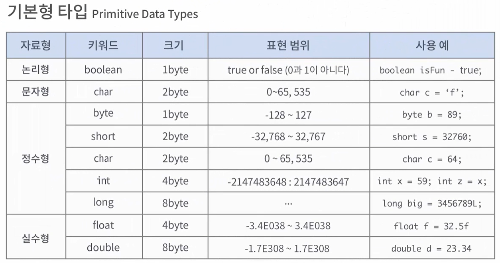

자바는 변수를 사용하기 위해서 반드시 타입을 지정해야 한다.

자바는 언어 차원에서 기본 데이터 타입을 제공한다.

---

기본형 타입 ( PrimitiveDataTypeExam )
- 기본형 데이터 타입은 가장 기본이 되는 데이터 타입으로써 `정수형`, `실수형`, `문자형`, `불린형` 을 의미한다.

---

논리형
- 논리형은 크기가 1byte이고 true와 false 중에 한 가지 값을 가질 수 있다.

문자형
- 문자형은 char로 2byte크기를 가집니다.
- 문자는 작은따옴표를 이용하여 한 글자를 표현할 수 있다.

정수형
- 정수형은 정수를 표현하는 데이터 타입인데, 표현할 수 있는 정수의 범위에 따라서 다양하게 제공된다.
- 정수형에서 가장 자주 사용하는 int는 4바이트이다.
- long형은 8byte크기를 가진다. int 보다 더 큰 범위의 정수를 표현하고 싶을때 사용한다.

실수형
- 실수형은 float과 double형이 있다.
- float은 4바이트, double은 8바이트로 double은 float보다 더 큰 범위의 실수를 표현할 수 있다.

리터럴
- 컴퓨터 과학 분야에서 리터럴이란, 소스 코드의 고정된 값을 대표하는 용어다.
- 리터럴은 일종의 값이다. true, false, 10, 11.1, a 등 이런 값 자체를 리터럴이라고 한다.

기본형 타입의 사용 방법
- `boolean isFun = true;`
- `char c ='f';`
- `int x = 59;`
- `long big = 3456789L;` ( 값을 적을때는 뒤에 소문자 l이나 대문자 L을 적어야 합니다. )
- `float f = 32.5f` ( float에 값을 대입할 때는 실수 뒤에 소문자 f나 대문자 F를 붙여야 합니다. )
- `double d = 23.34;`

---

기본형 타입(형)변환 ( PrimitiveDataTypeCastingExam )
- 형변환이란, 변수 또는 리터럴의 타입을 다른 타입으로 변환하는 것이다.
- 묵시적 형변환
  - 크기가 작은 타입을 크기가 더 큰 타입으로 바꿀 때에는 묵시적으로 형을 바꾸어 준다.
    - `int x = 50000;`
    - `long y = x;`
  - 이를 암묵적 형변환 이라고도 한다.
- 명시적 형변환
  - 크기가 더 큰 타입을 작은 타입으로 바꿀 때에는 명시적으로 변환 해주어야 한다.
    - `long x = 50000;`
    - `// int y = x;` ( 이렇게 묵시적으로 수행하면 컴파일러는 오류를 발생 시킨다. )
    - `int y = (int) x;` ( 반드시 `(타입)` 으로 명시적으로 형을 바꾸어 주어야 한다. )
  - 이를 강제 형변환 이라고도 한다.

