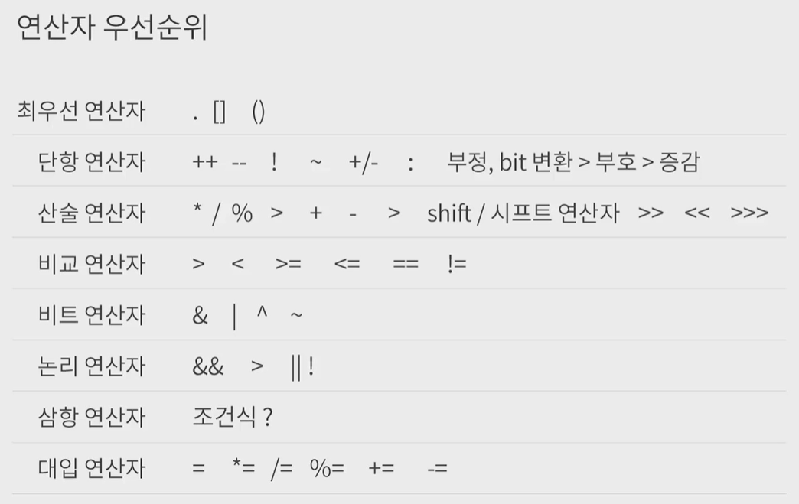
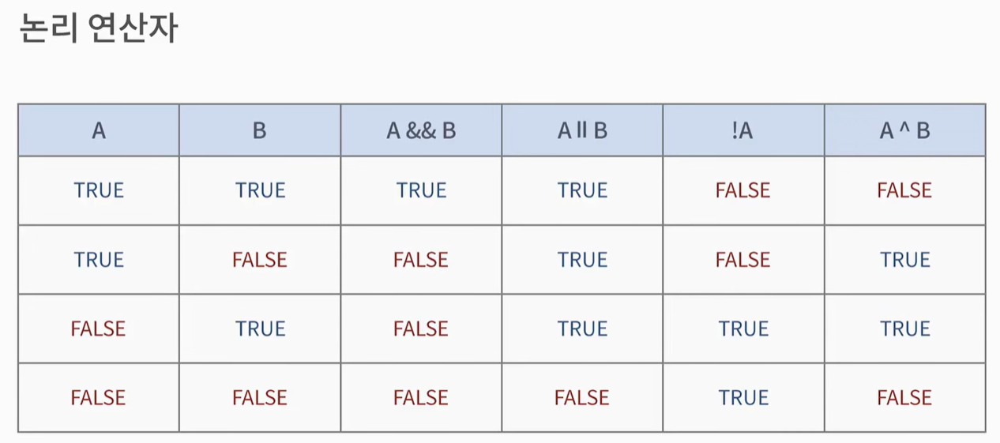

연산자와 연산식
- 연산: 데이터를 처리하여 결과를 산출하는 것을 말한다.
  - 연산자(Operator): 연산에 사용되는 표시나 기호 (`+`, `-`, `*`, `/`, `%`, `=`, ...)
  - 피연산자(Operand): 연산 대상이 되는 데이터 (리터럴, 변수)
  - 연산식(Expressions): 연산자와 피연산자를 이용하여 연산의 과정을 기술한 것


자바는 다양한 연산자를 제공한다.

연산자들을 간단하게 몇가지만 살펴보면 다음과 같다.

- 부호를 결정할 수 있는 부호 연산자 ( `+`, `-` )
- 산술 연산을 할 수 있는 산술 연산자 ( `+`, `-`, `*`, `/`, `%` )
- 증감 연산자 ( `++` , `--` )
- 대입 연산자 ( `=`, `+=`, `*=`, ...)
- 비교 연산자 ( `==` , `!=` , `<` , `>` , `<=` , `>=` )

프로그래머는 이러한 연산자들을 이용해서 연산식을 만들 수 있다.

참고로 여기서, 피 연산자가 1개인 연산을 할 수 있는데 이러한 연산자를 단항 연산자라고 한다. (부호 연산자와 증감 연산자가 이에 해당한다.)


---


참고) 위 내용 참고

`부호(+,-)`, `증감(++,--)`, `산술(+,-,*,/,%)`, `대입(=, +=, ..)`

- 연산식 ( `x = y + z;` )
  - y와 z를 더한 값을 x에 `대입`한다는 것을 의미
  - `=` 과 `+` 는 연산자이다.
    - `=`: 대입연산자 
    - `+`: 산술연산자
  - `y` 와 `z` 는 피연산자 이다.
  - `x = y+ z` 는 연산식이다.
- 부호를 결정하는 `부호 연산자`
- 산술 연산을 할 수 있는 `산술 연산자`
- 1씩 증가하거나 감소 시키는 `증감 연산자`
- 피 연산자가 1개인 연산자는 `단항 연산자`


부호 연산자와, 증감 연산자는 단항 연산자이다.

```java
//부호 연산자 
int a = -5;
int b = +a;
int c = -a;

//증감 연산자 
int d = ++c;
int e = c++;
int f = --c;
int g = c--;
```

피 연산자 하나로 연산할 수 없는 연산자 이항 연산자 ( 2개의 변수 이용한 산술 연산 )

```java
int i = 5;
int j = 2;  

System.out.println(i + j);
System.out.println(i - j);
System.out.println(i * j);
System.out.println(i / j);  
System.out.println(i % j);  
```

---

참고) 연산자 우선순위




---

참고) 논리 연산자

