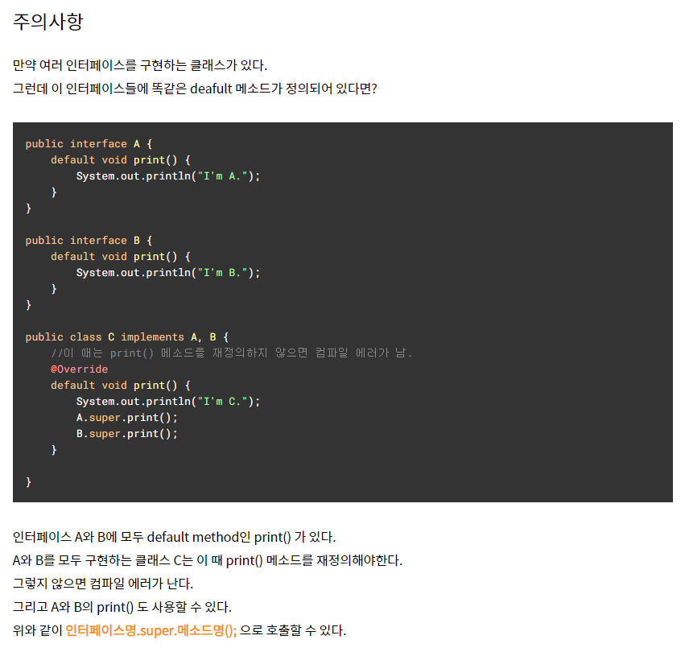

JAVA 8이 등장하면서 interface에 대한 정의가 몇 가지 변경되었다.

`default method & static method 추가`

- 기존 인터페이스는 추상 메서드만 가질 수 있었다. 자바8 부터는 `default method` 와 `static method` 를 정의할 수 있도록 변경되었다.
- 인터페이스 메서드가 `default` 라는 키워드로 선언되면, 메서드의 구현부를 작성할 수 있고, 또한 이를 구현한 클래스에서는 디폴트 메서드를 오버라이딩 할 수도 있다.


---


default 메소드

메소드가 default 키워드로 선언되면 메소드가 구현될 수 있다. 또한 이를 구현하는 클래스는 default메소드를 오버라이딩 할 수 있다.
```java
public interface Calculator {
    public int plus(int i, int j);
    public int multiple(int i, int j);
    default int exec(int i, int j){ // default로 선언함으로 메소드를 구현할 수 있다.
        return i + j;
    }
}

// Calculator 인터페이스를 구현한 MyCalculator 클래스
public class MyCalculator implements Calculator {

    @Override
    public int plus(int i, int j) {
        return i + j;
    }

    @Override
    public int multiple(int i, int j) {
        return i * j;
    }

  // @Override
  // public int exec(int i, int j) {
  //     return Calculator.super.exec(i, j);
  // }
}

public class MyCalculatorExam {
    public static void main(String[] args){
        Calculator cal = new MyCalculator();
        int value = cal.exec(5, 10);
        System.out.println(value);
    }
}
```
- `그런데 왜 자바8에서는 디폴트 메서드를 추가했을까 ?`
  - 인터페이스가 변경이 되면(메서드 추가 등), 인터페이스를 구현하는 모든 클래스들이 해당 메소드를 구현해야 하는 문제가 있다. 이런 문제를 해결하기 위하여 인터페이스에 메소드를 구현해 놓을 수 있도록 하였다.


---

static 메소드

```java
public interface Calculator {
    public int plus(int i, int j);
    public int multiple(int i, int j);
    default int exec(int i, int j){
        return i + j;
    }
    public static int exec2(int i, int j){ // static 메소드 
        return i * j;
    }
}

// 인터페이스에서 정의한 static 메소드는 반드시 "인터페이스명.메소드" 형식으로 호출해야 한다.
public class MyCalculatorExam {
    public static void main(String[] args){
        Calculator cal = new MyCalculator();
        int value = cal.exec(5, 10);
        System.out.println(value);

        int value2 = Calculator.exec2(5, 10);  //static메소드 호출 
        System.out.println(value2);
    }
}
```
- 인터페이스에 static 메소드를 선언함으로써, `인터페이스를 이용하여 간단한 기능을 가지는 유틸리티성 인터페이스를 만들 수 있게 되었다.`


---


주의사항)


- 출처: `https://codingwell.tistory.com/73`