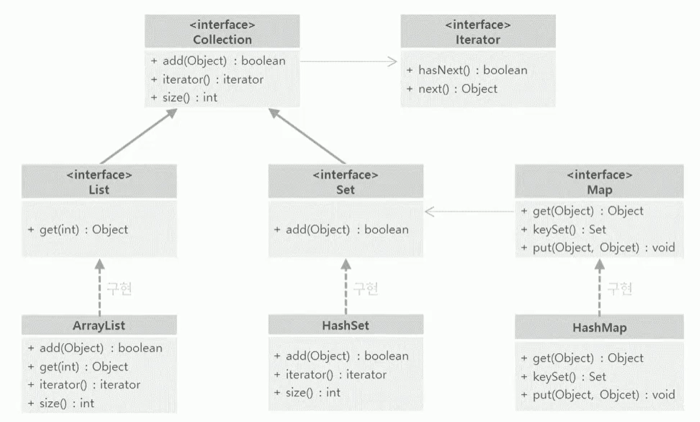

java.util 패키지는 유용한 클래스들을 많이 가지고 있는 패키지
- 날짜와 관련된 클래스인 Date, Calendar 클래스
- 자료구조와 관련된 컬렉션 프레임워크와 관련된 인터페이스와 클래스
- List, Set, Collection, Map은 자료구조 즉 컬렉션 프레임워크와 관련된 인터페이스

참고) 컬렉션 프레임워크

- 희미한 화살표: 의존
- 진한 화살표: 상속